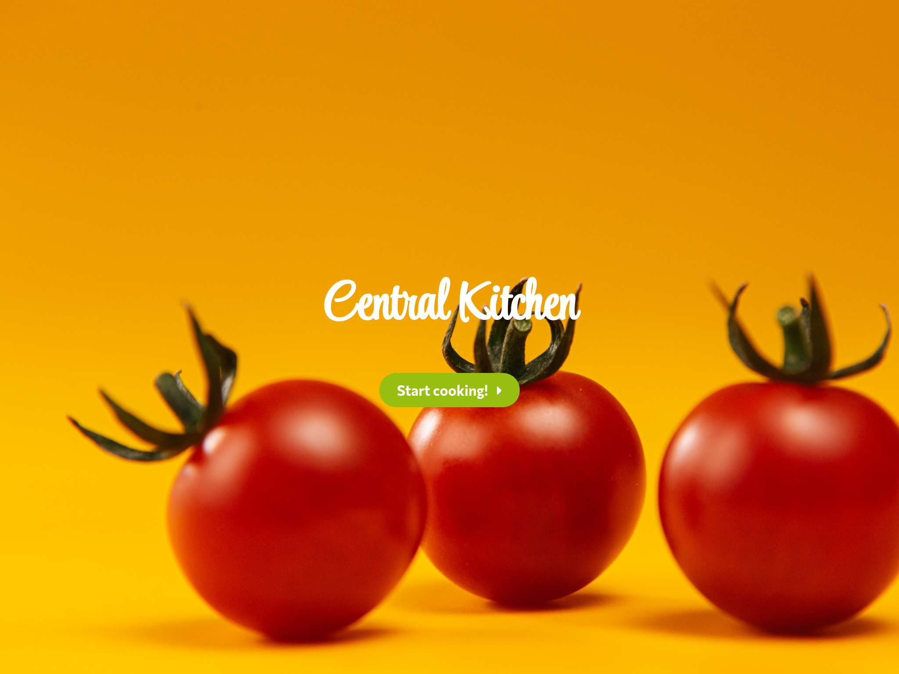
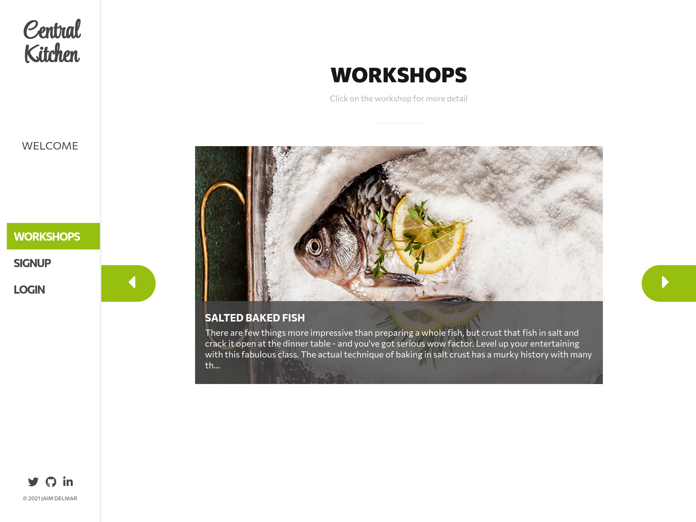

# Central Kitchen

> Welcome to Central Kitchen, your cooking learning experience. In this app, you can book online classes to learn how to prepare the most amazing dishes from around the world. Every class is guided by a professional chef live! So there is no excuse to amaze the people you love with a great meal! (This app is best to display on a tablet, but you can check it out on your laptop or pc)




## Live Demo

[Central Kitchen Demo](https://jadx2-central-kitchen.herokuapp.com/)

### Built With

This project was built using these technologies.

- ReactJS
- Prop-Types
- Redux
- React-Redux
- HTML / SASS
- NodeJS
- Testing-Library
- Redux-mock-store
- Fontawesome

### Backend repo

[Backend Repo](https://github.com/jadx2/central-kitchen-api)

### Getting Started

To get a local copy up and running follow these simple example steps.

### Prerequisites

- A web browser
- Node.js
- A terminal

### Clone

- Clone with SSH:

```
git@github.com:jadx2/the-meal-stock.git
```

- Clone with HTTPS:

```
https://github.com/jadx2/the-meal-stock.git
```

- Move to the temporary feature branch:

```
git checkout central-kitchen
```

### Usage

- Install dependencies with yarn:

```
  yarn
```

- Run server:

```
  yarn start
```

- If it doesn't open automatically paste the following in your browser:

```
  http://localhost:3000/
```

### Testing

- To test the app run the command for test in the root directory of the project:

```
yarn run test
```

## Contributors

👤 **Jaim Delmar**

- Github: [@jadx2](https://github.com/jadx2/)
- Twitter: [@thecatcodes](https://twitter.com/thecatcodes)
- LinkedIn: [@Jaim Delmar](https://www.linkedin.com/in/jaimdelmar/)

## :handshake: Contributing

Contributions, issues and feature requests are welcome!

Feel free to check the [issues page](https://github.com/jadx2/central-kitchen/issues).

## Show your support

Give a :star: if you like this project!

## Acknowledgement

Thanks and much appreciation to [Murat Korkmaz on Behance](https://www.behance.net/muratk) for this amazing design.

## 📝 License

This project is [MIT](https://opensource.org/licenses/MIT) licensed.
